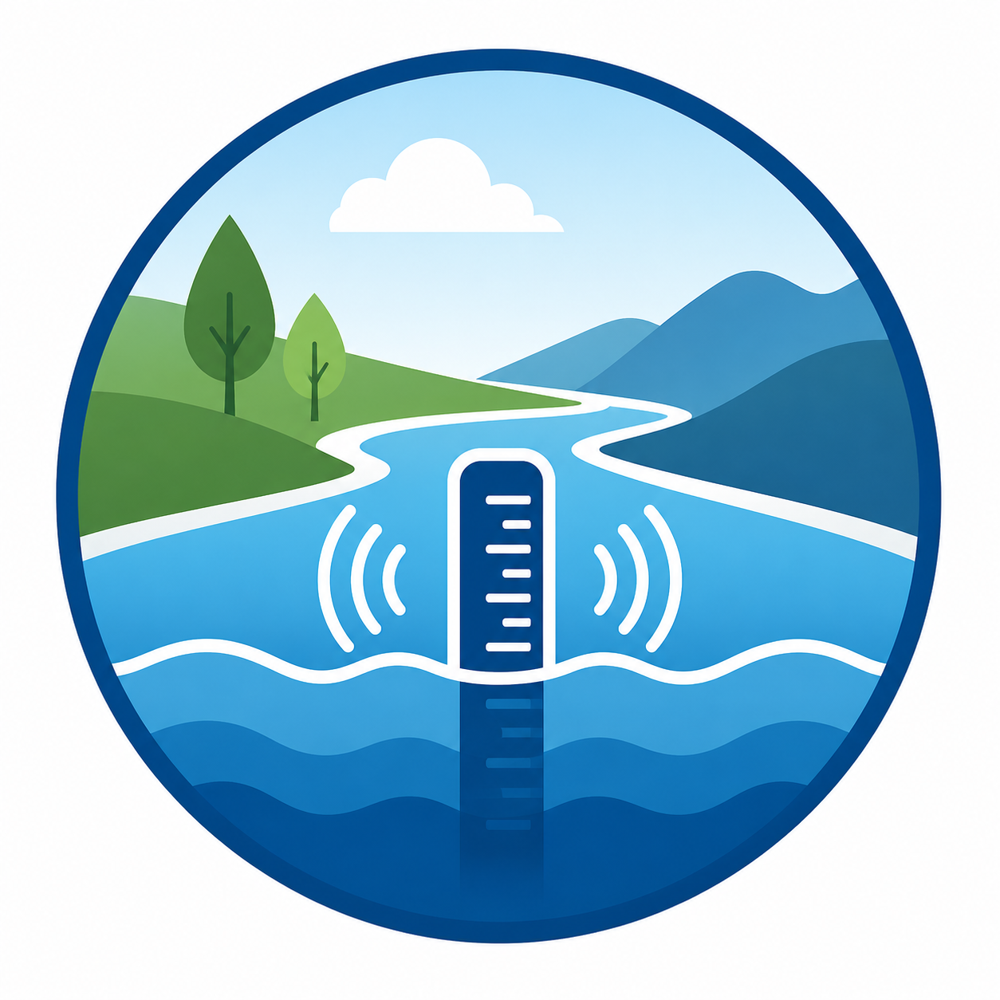

# Hydro Monitor

  

A modern Home Assistant integration for monitoring groundwater levels and other hydrological measurements from public data providers.

- 📍 Automatic station discovery
- 🌍 Uses your Home Assistant location
- 📈 Trend analysis
- 🩺 Diagnostics & System Health
- 🌐 English & German
- ✅ HACS compatible

  <strong>Hydrological monitoring for Home Assistant.</strong>

Hydro Monitor is a custom Home Assistant integration for public hydrological data. It is designed to help users discover nearby monitoring stations automatically and add groundwater, water-level, river-discharge, and spring-discharge data without having to know provider-specific station IDs.

> [!IMPORTANT]
> Hydro Monitor is currently under active development. NIWIS is the first supported provider.

## Features

- Native Home Assistant integration
- Automatic station discovery based on your Home Assistant location
- Groundwater level monitoring
- Water level monitoring
- River discharge monitoring
- Spring discharge monitoring
- 1-day trend sensor
- 7-day trend sensor
- Water level trend (enum)
- 30-day minimum and maximum sensors
- Last observation timestamp
- Measurement age sensor
- Built-in diagnostics download
- Home Assistant System Health support
- English and German translations
- HACS-compatible repository structure
- Automatic updates via DataUpdateCoordinator

## Vision

Hydro Monitor should become the central hydrological data integration for Home Assistant, automatically selecting the most appropriate public data provider.

## Current status

Current release: v0.3.0-alpha2

Hydro Monitor currently supports the NIWIS public hydrological data service.

The architecture is provider-based and designed to support additional national and regional hydrological services without requiring changes to the Home Assistant integration itself.

## Supported providers

| Provider | Status | Data |
|---|---|---|
| NIWIS | Experimental (Alpha) | Groundwater level, water level, discharge, spring discharge |

Additional providers may be added later without changing the core integration architecture.

## Installation

### HACS (planned)

HACS installation will be available once the first public release has been published.

## Configuration

After installation:

1. Open **Settings → Devices & Services**.
2. Add **Hydro Monitor**.
3. Select the desired measurement type.
4. Hydro Monitor automatically discovers the nearest monitoring stations using your Home Assistant location.
5. Select a station.
6. The integration creates all available sensors automatically.

## Available Sensors

| Sensor | Description |
|---------|-------------|
| Current value | Latest measurement |
| 1-day trend | Difference to the previous day |
| 7-day trend | Difference to the previous week |
| Water level trend | Rising / Stable / Falling |
| 30-day minimum | Lowest value during the last 30 days |
| 30-day maximum | Highest value during the last 30 days |
| Last observation | Timestamp of the latest observation |
| Measurement age | Hours since the latest observation |

## Diagnostics

Hydro Monitor supports Home Assistant's built-in diagnostics framework.

Diagnostics can be downloaded directly from the integration page while excluding sensitive location information.

## System Health

Hydro Monitor integrates with Home Assistant System Health and reports:

- configured stations
- providers
- update interval
- coordinator status
- latest observation

## Architecture

Hydro Monitor follows the native Home Assistant architecture:

- Config Flow
- DataUpdateCoordinator
- Translation keys
- Diagnostics
- System Health
- Provider abstraction
- Config Entry Diagnostics

The provider abstraction allows adding additional hydrological services without modifying the Home Assistant integration itself.

## Contributing

Contributions, ideas, bug reports and pull requests are welcome.

Please open a GitHub Issue before submitting larger feature changes or architectural modifications.